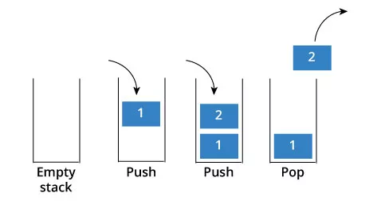

## Stack 栈

> * 一种后进先出(last in first off，LIFO)的线性结构
> * 相比数组，栈对应的操作是数组的子集
> * 只能从 `栈顶` 添加元素和取出元素
> * `栈底` 固定，不允许操作



### 应用场景

* Undo操作( 撤销 )，使用栈来记录操作，撤销操作 = 出栈
* 程序调用的系统栈
* 递归操作模拟系统栈、辅助遍历操作。
* 匹配问题

### 接口

用户仅关心接口提供的操作，而底层是不需要关心的。数组和链表都可以组成栈，所以操作特点就需要看栈是由数组还是链表生成的了，然后就会继承相应的操作特点。

``` TypeScript
interface IStack<E> {
    capacity: number;      // 容量
    size: number;          // 栈容器当前大小
    isEmpty: boolean;      // 是否为空
    
    push ( ele: E ): void; // 入栈
    pop (): E;             // 出栈
    peek (): E;            // 查看栈顶
}
```

### 复杂度分析

在空间足够大的情况下，栈的所有操作仅在栈顶操作，所以时间复杂度都是O(1)

| 方法 | 时间复杂度 |
|------|----------|
| push | O( 1 )   |
| pop  | O( 1 )   |
| peek | O( n )   |

