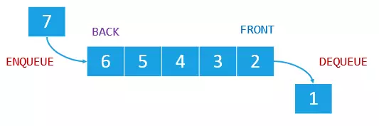

## Queue 队列

> *  队列(Queue)则是一种先进先出 (first in first out，FIFO)的线性结构
> * 相比数组，队列对应的操作是数组的子集
> * 只能从一端（队尾）添加元素，只能从另一端（队首）取出元素



### 应用场景

* 模拟现实生活着的队列
* 系统的进程调度
* 滑动窗口
* 实现任务、消息机制的功能

### 接口

``` TypeScript 
interface IQueue<E> {

    size: number;                   // 队列的当前大小
    isEmpty: boolean;               // 是否为空
    
    enqueue ( ele: E ): void;       // 入队
    dequeue (): E;                  // 出队
    getFront (): E;                 // 获取队首元素
    
}
```

### 复杂度分析

ArrayQueue：出队时，需要把其他元素向前挪一位，因此为O(n)的复杂度
| 方法     | 时间复杂度 |
|----------|----------|
| enqueue  | O( 1 )   |
| dequeue  | O( n )   |
| getFront | O( 1 )   |

LoopQueue：循环队列会维持一个队首、队尾位置的记录。出队时，只需更改队首索引。
| 方法     | 时间复杂度 |
|----------|----------|
| enqueue  | O( 1 )   |
| dequeue  | O( 1 )   |
| getFront | O( 1 )   |

