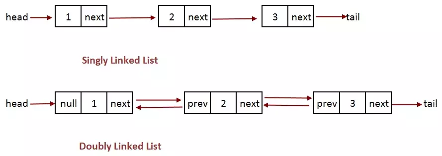

## LinkedList 链表

> * 最简单的动态数据结构
> * 线性结构
> * 具有天然的递归性质



### 优点

* 真正的动态，不需要处理固定容量的问题
* 充分利用计算机的空间, 实现灵活的内存动态管理

### 缺点

* 丧失了随机访问的能力

### 应用

* 不适用于频繁的查询操作

### 接口

节点：

``` TypeScript
interface INode<E> {
    e: E;               // 当前元素
    next: INode<E>;     // 指向下一个节点
    pre?: INode<E>      // 指向上一个节点
}
```

链表：

``` TypeScript
interface ILinkedList<E> {
    /*************** 基础属性 ***************/
    size: number;                           // 大小
    isEmpty: boolean;                       // 是否为空
    dummyHead: INode<E>;                    // 虚拟头节点（统一链表的操作逻辑）
    /*************** 操作接口 ***************/
    // 增
    add ( index: number, ele: E ): void;    // 指定位置添加节点
    addFirst ( ele: E ): void;              // 在头部添加节点
    addLast ( ele: E ): void;               // 在尾部添加节点
    // 删
    remove ( index: number ): E;            // 移除节点
    removeFirst (): E;                      // 移除首个节点
    removeLast (): E;                       // 移除末尾节点
    // 查
    get ( index: number ): E;               // 获取具体索引位置的节点数据
    getFirst (): E;                         // 获取头部的数据
    getLast (): E;                          // 获取尾部
    contains?( ele: E ): boolean            // 是否包含某个节点
    // 改
    set?( index: number, ele: E ): void     // 修改某个节点
}
```

### 复杂度分析

#### 添加操作，最坏情况 O( n )

| 方法     | 时间复杂度           |
|----------|---------------------|
| add      | O( n / 2 ) = O( n ) |
| addFirst | O( 1 )              |
| addLast  | O( n )              |

#### 删除操作， 最坏情况O( n )

| 方法        | 事件复杂度           |
|-------------|---------------------|
| remove      | O( n / 2 ) = O( n ) |
| removeFirst | O( 1 )              |
| removeLast  | O( n )              |

#### 查找操作

| 方法     | 时间复杂度 |
|----------|----------|
| get      | O( n )   |
| getFirst | O(1)     |
| contians | O( n )   |

#### 修改操作

| 方法 | 时间复杂度 |
|-----|----------|
| set | O( n )   |

