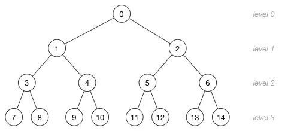
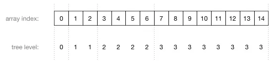

## Heap 堆

> * 完全二叉树
> * 父节点的键值总是不大于它的孩子节点的键值（小顶堆）, 堆可以分为小顶堆和大顶堆





### 优点

* 操作的时间复杂度稳定，插入和移除操作平均

### 缺点

### 应用

* 优先队列
* （TOP K 问题）在N个元素中选出前M个元素

### 堆操作

**上浮( shift_up )：** 与一个父亲节点比较

1. 从插入的位置开始，与父亲节点做比较
2. 如果比父亲节点大，则交换位置
3. 一直*上浮*直至根节点or没有小于上浮节点的父亲节点

**下沉( shift_down )：** 与两个孩子节点比较

1. 比较左右孩子
2. 与比较大的孩子进行位置交换
3. 继续*下沉*直至没有左右孩子or没有大于该节点的孩子节点

**插入( push ):**

1. 在堆最后面添加一个元素
2. 从新添加的位置开始，执行*上浮*操作

**移除( extra_top ):**

1. 移除堆顶元素
2. 把堆的最后一个元素放在堆顶
3. 从堆顶开始执行*下沉*操作

**堆化( heapify ):**把一个数组转变一个堆的过程

1. 从第一个非叶子节点开始，执行*下沉*操作
2. 遍历所有非叶子节点，直至堆顶的根节点

### 接口

``` TypeScript
interface IHeap<E> {
    /*************** 基础属性 ***************/
    size: number;               // 获取堆的大小
    isEmpty: boolean;           // 是否为空
    capacity?: number;           // 堆容量
    /*************** 操作接口 ***************/
    // 辅助方法
    _getLeft ( index: number ): number;         // 获取左孩子的索引
    _getRight ( index: number ): number;        // 获取右孩子的索引
    _getParent ( index: number ): number;       // 获取父亲节点索引
    // 调用方法
    push ( ele: E ): void;                  // 添加元素
    getTop (): E;                           // 查看顶部元素
    extraTop (): E;                         // 排出堆顶元素
    _shiftUP ( index: number ): void;       // 上浮 插入数据的时候使用
    _shiftDown ( index: number ): void;     // 下沉 取出数据的时候使用
    heapify ( arr: E[] ): void;             // 堆化
}
```

### 复杂度分析

| 操作     | 时间复杂度   |
|----------|-------------|
| push     | O( n logN ) |
| extraTop | O( n logN ) |
| getTop   | O( 1 )      |
| heapify  | O( n )      |

### 参考

[数据结构：堆（Heap）](https://www.jianshu.com/p/6b526aa481b1)

